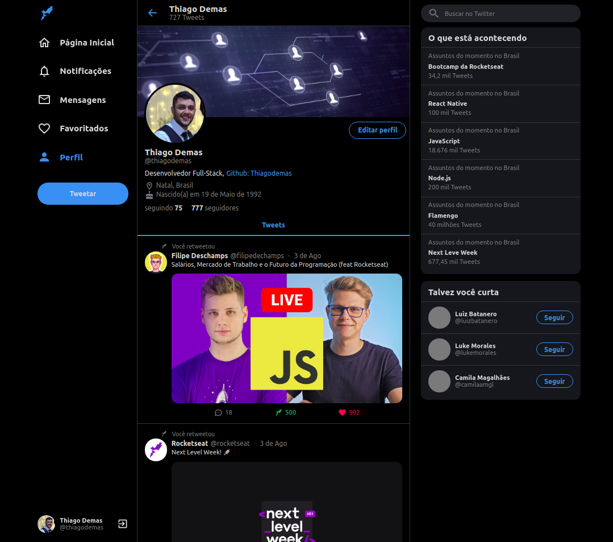

<h1 align="center">
    Tddevwitter
</h1>

 

  

## :rocket: Tecnologias

Esse projeto foi desenvolvido com as seguintes tecnologias:

- [React](https://pt-br.reactjs.org/)
- [TypeScript]()
- [Styled-Components](https://styled-components.com/)

## 💻 Projeto

Este é um projeto de estudo, onde é recriado a interface do Twitter (desktop).

Link da Aplicação: https://twittertd.netlify.app/

 #ReactJs #TypeScript #React
